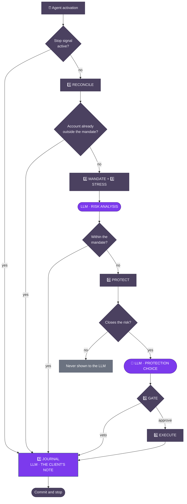

# 🛡️ Drawdown Guard

**Investors can say how much they can afford to lose in the worst scenario. But portfolios can't keep that promise on their own.**

So we built an agent that does.

Drawdown Guard is an autonomous AI trading agent that checks a portfolio every weekday against its client's downside limit, and steps in with an options overlay the moment it doesn't.

**The market moves. The loss mandate doesn't. Drawdown Guard keeps the two in line.**

🔴 **[Demo Application Platform](https://ol1ak5.github.io/Drawdown-Guard/)** · 📓 **[Journal](journal/)**

---

## 🎯 The problem

**Just knowing a loss tolerance limit is not a loss control.**

Investors can decide how much downside they can accept. But once the portfolio is built, that number doesn't enforce itself.

Markets move. Positions change. Options expire. New exposure is added.

**The problem is not knowing what the market will do next.** It's keeping the portfolio aligned with the risk limit the client already chose. That's exactly what Drawdown Guard is built to solve.

## 💡 The solution

Drawdown Guard stands between the client's promise and the portfolio, turning a downside limit into a continuously monitored constraint the portfolio is checked against.

Every weekday, the agent wakes up and asks one question: 
> **If the market fell today, would the portfolio still be inside the number it was given?**

If yes, the agent records the result and stays on guard.
If no, it measures the existing gap, and evaluates the available options on today's actual option chain to bring the portfolio back within its mandate.

## 👤 One client, one promise

For this hackathon, we turn the problem into a concrete situation.

### Initial settings

Our simulated client has a c. $100,000 portfolio that includes:

| Ticker | Shares | Entry price | Value | Exposure | Description |
|---|---|---|---|---|---|
| **IWM** | 100 | 297.34 | **$29,734** | Equity | Small-cap index |
| **XLF** | 900 | 58.25 | **$52,425** | Equity | Financial sector |
| **BIL** | 100 | 91.66 | **$9,166** | Fixed income | 1-3 month T-bills |
| **Cash** | n.a. | n.a. | **$8,675** | Liquidity | Used for the hedge |

### The promise

The client's mandate is simple:

> *“In the worst case, I can tolerate a 10% loss per year.”*

**Just two numbers:**

- 🔟 **10%** - the most the client can lose in our case. Roughly $10,000 on this account. The exact figure is fixed the day the promise opens.
- 📆 **12 months** - the window that promise has to hold.

### Client's activity during the hackathon

The client changes the portfolio mid-flight:
- Sells the whole XLF position of 900 shares on September 2nd
- Buys 100 shares of AAPL on September 3rd

The portfolio is intentionally not static. A client who never touches their allocation isn't the point. That gives Drawdown Guard a real job - it keeps the changing portfolio aligned with a fixed risk mandate.

### What actually happened, day by day

| Date | | What | Result |
|---|---|---|---|
| Aug 28 | 👤 | Portfolio opened: 100 IWM, 900 XLF, 100 BIL | The promise starts here: $99,978 reference, $9,998 budget |
| ↳ | 🤖 | Priced protection, sent limit orders at the ask | Both expired unfilled. The ask moved before the cycle finished |
| Aug 31 | 🤖 | Re-priced on the day's chain, limit reaching a quarter of the spread past the offer | IWM put filled - 1 contract at $15.06 |
| Sep 1 | 🤖 | Same for XLF, on a new strike closer to spot than the failed one | XLF put filled. 9 contracts at $3.50. Book fully hedged |
| Sep 2 | 👤 | Sold the entire XLF position, 900 shares | Nine puts now stood behind a position that no longer existed |
| ↳ | 🤖 | Recognised the hedge as redundant and sold it back | 9 contracts released at $3.15. The first release this project has executed |
| Sep 3 | 👤 | Bought 100 shares of AAPL | New exposure, uninsured |
| ↳ | 🤖 | Priced and bought a put on AAPL in the same cycle | 1 contract at $26.55, struck at 310 |

👤 client · 🤖 agent · ↳ same day as the row above

## 🔄 The Agent Loop



## ⚙️ How the agent actually works

Seven steps presented as five nodes in the LangGraph cycle. Every half hour while the market is open. Fully autonomous.

| # | Step | The agent does | Node |
|---|---|---|---|
| 1️⃣ | **Reconcile** | Asks the broker what is actually held. Never assumes | `reconcile` |
| 2️⃣ | **Mandate** | Turns the client's tolerance into a fixed dollar budget. The LLM acts as a risk analyst: it is handed the material and not the conclusion, and names what needs attention | `mandate` |
| 3️⃣ | **Stress** | Runs the book down the whole descent and measures the uncovered risk | `mandate` |
| 4️⃣ | **Protect** | Builds valid hedge candidates. The LLM chooses between eligible structures | `protect` |
| 5️⃣ | **Gate** | Checks every order against hard limits before it can reach the broker | `execute` |
| 6️⃣ | **Execute** | Sends the approved orders, then reads back what the broker actually did | `execute` |
| 7️⃣ | **Journal** | Writes down what happened and why, in plain language, with an LLM | `journal` |

## 🚩 Where the AI is

The deterministic risk engine calculates the numbers. The LLM reasons over the decisions that require judgment.

**LLM call #1 - Risk analysis**

On every cycle, the LLM receives the material and answers the following question:

> *Given this portfolio, this mandate and this existing protection, which positions carry a risk issue that needs attention, and what should be reviewed?*

For example:

```
Portfolio change:
XLF: 900 → 0

Existing protection:
9 XLF puts

LLM:
Risk issue: existing XLF protection no longer corresponds to an equity position.
Recommendation: review the XLF hedge for removal.
```

**LLM call #2 - Protection choice**

When protection is required, the LLM chooses between eligible hedge structures. **Eligibility is determined in code**, so the model only sees options that can fully satisfy the client's mandate. It then chooses the structure that offers the best trade-off under today's market conditions, without being able to break the promise or sell the client's shares.

If the LLM fails, returns an invalid choice or names a structure that was not offered, the deterministic rule remains the fallback.

Every protection choice records:
- `decided_by` - the model or the rule
- `rule_would_have` - what the rule would have taken
- `rule_because` - the rule's own reasoning

**LLM call #3 - The client's note**

After the orders have gone and their fills have been read back, the LLM writes the paragraph a client reads. Nothing is left to decide by then, so it can be unclear but it cannot be expensive.

## 🔗 The Chain of Decision

**1️⃣ How much loss can the client tolerate?** 

The client only defines the maximum loss he is willing to tolerate:

> *Maximum drawdown: 10%*

On 28 August 2026, at the moment the promise opened, the portfolio was worth $99,978. So the maximum loss allowed by the mandate is $9,998. That becomes the drawdown budget.

**$9,998 is not the amount we expect the client to lose.** It's the maximum loss the protection framework is allowed to leave exposed. The objective is always to lose less.

**2️⃣ How much of that budget belongs to each position?**

Our client's portfolio contains more than one instrument:
- XLF: 900 shares
- IWM: 100 shares

The agent allocates the budget proportionally to each instrument's weighted contribution to portfolio risk, as specified by the mandate.

**For this portfolio, that gives:**

```
XLF → $6,403
IWM → $3,595
────────────
Total $9,998
```

**3️⃣ How do we protect the portfolio?**

Drawdown Guard says: "With options".

| Protection | How it works | Cost | Upside |
|---|---|---|---|
| 🛡️ **Protective put** | Buy a put against the shares | Pay premium upfront | Keep all upside |
| 🎯 **Collar** | Buy a put and sell a call | Call premium helps pay for the put | Upside is capped at the call strike |

**The shares are never sold to cover the existing gap.** The client can sell shares at any time, but the agent doesn't liquidate them simply to close the drawdown gap.

**4️⃣ Which option should we use today?**

The agent compares both structures using the live option chain. The LLM chooses between candidates that have already passed the deterministic risk filters.

The decision depends on:
- the current option prices;
- implied volatility;
- the cost of protection;
- the client's constraints.

**5️⃣ How many option contracts do we need?**

The number of contracts comes from **the number of shares**. The objective is to avoid leaving part of the portfolio exposed. A hedge over half a portfolio is not half a promise kept, it's a promise broken at half the price.

One standard equity-option contract covers 100 shares.

```
XLF:  900 shares → ceil(900/100) = 9 contracts
IWM:  100 shares → ceil(100/100) = 1 contract
```

**6️⃣ Which strike fits the mandate?**

Once the agent knows how many contracts are required, it has to decide which strike to buy. The strike **always** comes from the budget.

```
XLF   share of the budget $6,403
  fall to the strike   (57.65 − 56) × 900  =  $1,481
  premium                  3.50 × 9 × 100  =  $3,150
                                              ───────
  worst case                                  $4,631   ≤  $6,403  ✅

IWM   share of the budget $3,595
  fall to the strike  (291.31 − 275) × 100  =  $1,631
  premium                  15.06 × 1 × 100  =  $1,506
                                              ───────
  worst case                                  $3,137   ≤  $3,595  ✅
```

> The premium is part of the risk budget.
> Protection is not free: the cost of buying the hedge is charged against the same loss allowance.

### Execution price

Every order is a limit order. After Day 1 unfilled orders, we allowed the limit price to reach past the crossed price by a fraction of the spread. That fraction was a quarter, and on Day 2 it was still not enough - so it is now the whole spread.

On Day 1, the initial limits were exactly at the ask:

| Options | Our limit | Ask, minutes later | Filled |
|---|---|---|---|
| XLF 54 put ×9 | 2.71 | 2.78 | ❌ unfilled |
| IWM 275 put ×1 | 14.48 | 14.60 | ❌ unfilled |

On Day 2, one of the two filled:

| Options | Our limit | Result |
|---|---|---|
| IWM 275 put ×1 | 15.06 | ✅ filled at 15.06 |
| XLF 54 put ×9 | 2.78 | ❌ unfilled |

On Day 3, the new rule worked and the book was fully hedged:

| Options | Our limit | Result |
|---|---|---|
| IWM 275 put ×1 | n.a. | ✅ filled on Day 2 at 15.06 |
| XLF 56 put ×9 | 3.53 | ✅ filled at 3.50 |

**7️⃣ What does the protection actually do?** 

The answer is below. Without protection, losses continue to grow as the market falls. With the options in place, the loss reaches a floor.

**Figures as of 28/08/2026, the day this hedge was priced.** Every number here moves with the market: a different day means a different spot price, so both the distance from spot down to the strike and the premium the chain is charging for it change. This table is one snapshot of the mechanism, not a claim about what it costs today. For that, see the [live status page](https://ol1ak5.github.io/Drawdown-Guard/).

**Protective put**

| Market falls | Without the agent | **With the agent** | Premium paid | **Floor + Premium** | Drawdown budget | Promise |
|---|---|---|---|---|---|---|
| -10% | $8,202 | **$5,923** | $3,801 | **$9,724** | $9,998 | ✅ |
| -20% | $16,404 | **$5,923** |$3,801 | **$9,724** | $9,998 | ✅ |
| -35% | $28,708 | **$5,923** | $3,801 | **$9,724** | $9,998 | ✅ |
| -50% | $41,011 | **$5,923** | $3,801 | **$9,724** |$9,998 | ✅ |
| -90% | $73,820 | **$5,923** | $3,801 | **$9,724** |$9,998 | ✅ |
| -100% | $82,022 | **$5,923** | $3,801 | **$9,724** |$9,998 | ✅ |

**Collar**

| Market falls | Without the agent | **With the agent** | Net premium | **Floor + Net premium** | Drawdown budget | Promise |
|---|---|---|---|---|---|---|
| -10% | $8,202 | **$5,923** | $2,408 | **$8,331** | $9,998 | ✅ |
| -20% | $16,404 | **$5,923** | $2,408 | **$8,331** | $9,998 | ✅ |
| -35% | $28,708 | **$5,923** | $2,408 | **$8,331** | $9,998 | ✅ |
| -50% | $41,011 | **$5,923** | $2,408 | **$8,331** |$9,998 | ✅ |
| -90% | $73,820 | **$5,923** | $2,408 | **$8,331** |$9,998 | ✅ |
| -100% | $82,022 | **$5,923** | $2,408 | **$8,331** |$9,998 | ✅ |

For a collar, the net premium the client pays is calculated as s premium paid for the put reduced by the premium received by selling a call:

```
$3,801 - $1,393 =  $2,408 
```

**8️⃣ When the agent steps in**

The trigger is mechanical:

```
uncovered_risk = worst_loss(current_book) − budget

uncovered_risk > 0
        ↓
    Action Required
```

The portfolio can become uncovered for several reasons:

| Trigger | Why it uncovers risk |
|---|---|
| 📈 **Portfolio grew** | More exposure behind the same fixed budget. The floor has to be re-struck |
| 🛒 **Client bought** | New holdings arrive unhedged. Adding protection when a client invests is the unglamorous half of the job |
| 💵 **Client sold** | Risk exposure falls. The agent reassesses the book and returns any protection that is no longer needed |
| ⏳ **Hedge aged** | The market moved and the strike that used to hold the floor no longer reaches it |
| 📅 **Coverage expired** | Coverage silently ended. Nothing but recomputation notices |

## 🔌 Alpaca Trading API and MCP Server

Drawdown Guard uses the Alpaca Trading API and Alpaca MCP Server to read the account, positions, market data and option chain, submit orders, and reconcile execution.

```
Drawdown Guard
      ↓
Alpaca MCP tools
      ↓
Alpaca Trading API
      ↓
Paper account
```

The agent decides what should happen. MCP provides the controlled interface to the broker. The deterministic Gate remains the final trading boundary.

## 🛑 How to Stop the Agent

It is an autonomous agent trading an account on a schedule, so there has to be a way to stop it from a phone, without a laptop and without touching the code:

```bash
touch HALT && git add HALT && git commit -m "halt" && git push
```
**It stops the agent, not the protection.** Every position stays exactly where it is. Hedges already bought keep working. A stop button that liquidated the client's protection would disarm the portfolio at the precise moment somebody was worried enough to press it.

## 🔧 What We Improved during the Hackthon Week

| When | What we noticed | How we found out | The improvement |
|---|---|---|---|
| Aug 28 | Limits set exactly at the ask never filled | Journal said `submitted: 2`; the account held nothing | The limit reaches past the offer by a fraction of the spread |
| Aug 28 | "Sent" was being reported as "bought" | Two facts sat in the record with nothing connecting them | Three outcomes instead of two: `filled`, `partial`, `working` |
| Aug 28 | The LLM sat 41 seconds between pricing an order and sending it | Timestamps in the journal | The model now writes *after* the fills are read back, not before |
| Aug 29-30 | The cycle did not run at all | Scheduled runs arrived at 23:24 UTC, hours after the close | Thirteen attempts a day, plus a Cloudflare worker that presses the first one on time |
| Aug 31 | A quarter of the spread was still not enough | The XLF ask drifted 2.72 → 2.87 across the session | Cross the whole spread |
| Aug 31 | A client selling near the close would go unseen until the next morning | Reading the schedule against the scenario | A full cycle every half hour, all session |
| Sep 2 | A hedge on a position the client had just sold disappeared from the book | An option needs its underlying's spot to be shocked, and the shares were gone | Quote the underlying directly for any leg whose shares no longer exist |
| Sep 2 | `release` recommended handing the hedge back, but no order could be built | The liquidity filter left one tradable strike out of sixty-seven | Close against the unfiltered chain - a filter for buying is not a rule for leaving |
| Sep 2 | The gate refused the closing order | Assignment probability read on a contract the account was long, not short | Nobody can be assigned an option they own; the check no longer asks the question |

## 🏁 Main Tracks

**Track 03 - Hedging & Risk Protection Agents**

Built directly against the four agent types this track names:

| Track agent type | How Drawdown Guard implements it |
|---|---|
| 📉 **Drawdown-defense agents** | Checks the portfolio against a client-defined loss budget and keeps the book within its mandate |
| 🛡️ **Protective put strategy** | Uses long puts to cover the calculated downside shortfall |
| 🎯 **Collar strategy** | Priced on every cycle against the put, and taken when the call is the richer leg. It has not been taken yet: on this book the call has priced below the put on every reading, so buying outright won 37 times out of 37. The journal records every declined collar and the volatilities that declined it |
| ♻️ **Hedge rebalancers for equity portfolios** | Adds protection when risk is uncovered and hands it back on a margin band. The client's sale on day 4 and purchase on day 5 are what exercise both halves |

## 🧰 Technologies

| Technology | Description |
|---|---|
| **Alpaca Trading API** | Live paper account, level 3 |
| **Alpaca MCP Server** | Every broker call goes through MCP |
| **LangGraph** | The five-node cycle, including the conditional halt edge |
| **LangChain** | The provider-agnostic chat interface behind all three model calls |
| **Google Gemini** | Risk analysis, hedge structure selection, and the client's note |
| **NumPy · SciPy · pandas** | Black-Scholes, the stress ladder, the payoff maths |
| **Pydantic** | Mandates and limits are validated types |
| **GitHub Actions** | The agent's heartbeat. Thirteen autonomous cycles a day, every weekday |
| **GitHub Pages** | The live status page, rebuilt from the journal after every cycle |
| **Cloudflare Workers** | Asks for all thirteen cycles on time |
| **Python 3.11** | The language the project runs on |

## ▶️ Try it

```bash
uv sync
cp .env.example .env                           # your Alpaca paper keys
uv run python3 scripts/healthcheck.py          # says why it won't trade, if it won't
uv run python3 scripts/run_cycle.py --dry-run  # decides, journals, submits nothing
uv run python3 scripts/build_site.py           # rebuilds the status page
uv run pytest
```

🔐 `ALPACA_PAPER_TRADE=true` is a hard interlock. The program refuses to start without it. This has never traded real money.

## 📁 Layout

```
src/drawdownguard/
  risk/        mandate, period, stress ladder, remedies, and the gate
  agent/       the cycle, its nodes, the roles, the guards
  market/      Alpaca adapters: account, chain, features, history
  options/     Black-Scholes pricing and payoff
  execution/   order submission and broker reconciliation
  mcp/         the Alpaca MCP client and its toolsets
  journal/     the writer, and the status page built from the record
  config/      risk.yaml, the permanent limits; mandates.yaml, the promises
               scenario.yaml, the client's week, committed before it runs
  scripts/     run_cycle, healthcheck, build_portfolio, build_site, client_action
  scheduler/   the Cloudflare worker that asks for every cycle on time
  journal/     the append-only record, one file per day
  data/        committed state: the promise, the holdings snapshot, price history
  docs/        the published status page
  tests/       420 of them
```
