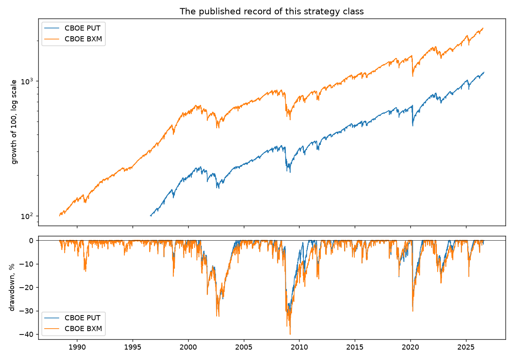
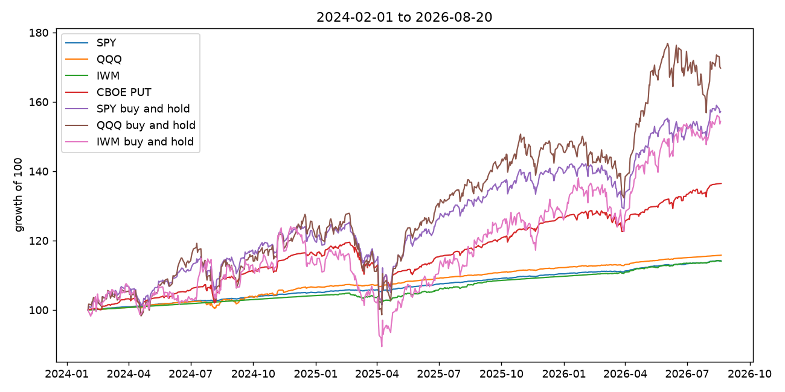

# Drawdown-Guard: backtest report

Window 2024-02-01 to 2026-08-20. Capital 1,000,000. Universe SPY, QQQ, IWM.

Read the layers in order. The published indices come first because they were not produced by this project and are the least suspect evidence in the document. Our own numbers are read against them.

## 1. The published record, which we did not produce



CBOE's `PUT` index writes cash-secured S&P 500 puts monthly; `BXM` writes covered calls. They are the same strategy class as this agent, with a public record across the 2000, 2008 and 2020 drawdowns.

- `PUT`, 1996-08-02 to 2026-08-21: 8.53% a year, worst drawdown **37.1%**, Sharpe 0.61.
- `BXM`, 1988-06-01 to 2026-07-17: 8.77% a year, worst drawdown **40.1%**, Sharpe 0.71.

Those drawdowns are the honest half of this strategy class. Writing puts is short a crash, and both indices took roughly a third off in 2008. Any result below that does not show a comparable loss has either avoided the regime or has a bug.

## 2. Our engine over the same window



`PUT` over 2024-02-01 to 2026-08-20: 36.48% total, worst drawdown 15.06%.

## 3. Results

Two columns, always. A cash-secured put ties up cash, and in a real account that cash earns Treasury yield. Reporting only the total claims credit for the yield; reporting only the premium describes a strategy nobody would run.

**These are two runs, not one run split two ways.** Turning the collateral yield off changes the decisions, not only the accounting: a smaller balance means a smaller capital budget, smaller positions, fewer assignments, and so a different number of cycles. On SPY the premium-only configuration opened eight cycles and the funded one opened three. The left column is therefore not the premium component of the right column, and subtracting one from the other does not isolate anything. Read each as its own result.

| symbol | premium only | with collateral | ann. | worst DD | Sharpe | cycles |
|---|---|---|---|---|---|---|
| IWM | 3.07% | 14.08% | 5.33% | **2.79%** | 3.11 | 6 |
| QQQ | 6.29% | 15.80% | 5.95% | **2.02%** | 3.00 | 11 |
| SPY | 1.01% | 14.15% | 5.35% | **0.58%** | 6.01 | 3 |

### The losses, stated first

- **IWM**: worst cycle 178, 3 of 6 cycles assigned (50%), maximum drawdown 2.79%.
- **QQQ**: worst cycle 512, 3 of 11 cycles assigned (27%), maximum drawdown 2.02%.
- **SPY**: worst cycle 390, 1 of 3 cycles assigned (33%), maximum drawdown 0.58%.

### Where these numbers should not be believed

- **IWM**: A Sharpe of 3.11 is above what the published index achieves over most decades. Treat it as a defect to be found, not as an edge. A maximum drawdown of 2.79% is small for a wheel. It follows from low deployment rather than from skill: the wheel held a position on a minority of days and sat in cash otherwise, so there was little exposure to draw down.
- **QQQ**: A Sharpe of 3.00 is above what the published index achieves over most decades. Treat it as a defect to be found, not as an edge. A maximum drawdown of 2.02% is small for a wheel. It follows from low deployment rather than from skill: the wheel held a position on a minority of days and sat in cash otherwise, so there was little exposure to draw down.
- **SPY**: A Sharpe of 6.01 is above what the published index achieves over most decades. Treat it as a defect to be found, not as an edge. A maximum drawdown of 0.58% is small for a wheel. It follows from low deployment rather than from skill: the wheel held a position on a minority of days and sat in cash otherwise, so there was little exposure to draw down.

- The sample is **20 cycles across three symbols**. A Sharpe ratio estimated from that many observations is a description of this window, not a property of the strategy. It is quoted above only because omitting it would look like concealment.

## 4. What is modelled rather than measured

Alpaca's option history returns daily bars, not quotes. Four quantities are therefore modelled, and each is carried in `BacktestResult.params` rather than left in a footnote:

- **Execution price**: bar close less a 2.0% haircut, booked as the fill and never as the mid. Mid-pricing is the most common way a wheel backtest invents returns nobody could have captured.
- **Implied volatility**: back-solved from that close, so the delta band and the vega budget come from the price actually printed.
- **Collateral yield**: a flat 4.50% compounded per trading day. The honest version is the daily bill series, which is not cached.
- **Open interest**: does not exist historically at all. The check is disabled explicitly — `['min_open_interest']` — and replaced by a measured filter: the contract must have traded that day.

## 5. Limitations

1. **Sample size.** 20 cycles over 2.5 years. Not enough to distinguish skill from window.
2. **No spreads in the modelled path.** The haircut stands in for a spread that would really have been crossed; it is a constant, and real spreads widen exactly when it hurts most.
3. **Assignment is resolved European-style at expiry**, by the actual underlying close. Early exercise is ignored, which flatters the result: American options on dividend-paying ETFs are exercised early around ex-dividend dates, and the wheel would have been assigned sooner and more often than shown.
4. **The window contains no crash.** February 2024 to August 2026 has no 2008 and no March 2020. The published indices in section 1 are the only evidence here about how this strategy behaves in one.

## 6. Reproducing this

```bash
uv run python3 scripts/run_backtest.py --symbol SPY
uv run python3 scripts/run_backtest.py --symbol SPY --cash-rate 0
uv run python3 scripts/build_report.py
```

The backtest imports the live optimizer and the live risk gate rather than reimplementing them. A backtest running different code from the agent measures a strategy nobody is going to trade.
